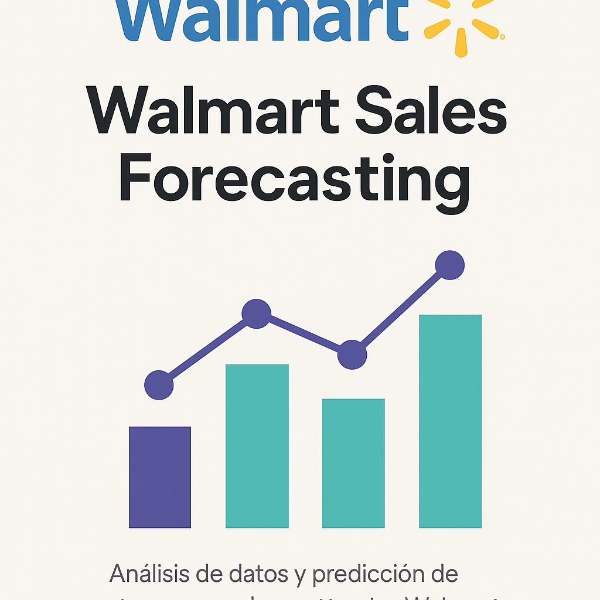

<p align="center">
  
</p>

<h1 align="center">🛒 Walmart Sales Forecasting</h1>
<p align="center">Predicción de ventas semanales en tiendas Walmart con Machine Learning</p>

---

## 📌 Descripción

Este proyecto analiza datos reales proporcionados por Walmart para estudiar el comportamiento de las ventas semanales, con especial énfasis en el impacto de fechas festivas como **Navidad**, **Thanksgiving**, **Super Bowl** y **Labor Day**.

Se desarrolló un modelo de aprendizaje automático que permite predecir las ventas semanales por tienda, incorporando factores como el tiempo, el desempleo, la inflación, promociones y estacionalidad.

---

## 🎯 Objetivos

- Analizar los factores que impactan las ventas semanales.
- Evaluar la influencia de las semanas festivas en el comportamiento de compra.
- Predecir ventas semanales utilizando técnicas de Machine Learning.
- Desarrollar un portafolio profesional que demuestre habilidades en EDA, modelado y visualización de datos.

---

## 🧰 Herramientas y tecnologías

- 🐍 Python (Google Colab)
- 📊 Pandas, Matplotlib, Seaborn
- 🧠 Scikit-learn (Random Forest)
- 💾 Dataset: [Walmart Sales Forecast - Kaggle](https://www.kaggle.com/datasets/aslanahmedov/walmart-sales-forecast)

---

## 📈 Análisis Exploratorio (EDA)

- Limpieza y tratamiento de valores nulos.
- Visualizaciones de tendencias de ventas.
- Análisis de correlación entre variables.
- Estudio del impacto de días festivos.

---

## 🤖 Modelado

- División de datos: Train/Test.
- Modelo aplicado: `RandomForestRegressor`.
- Métricas de evaluación:
  - RMSE: 21,962.37
  - R²: 0.0750

---

## 🧠 Conclusiones

- Las semanas festivas tienen un impacto relevante en el volumen de ventas.
- Variables como el desempleo y la temperatura muestran cierta relación con la variabilidad en ventas.
- Se recomienda seguir optimizando el modelo con:
  - Ingeniería de características
  - Algoritmos más avanzados (XGBoost, LightGBM)
  - Ajuste de hiperparámetros

---

## 🚀 Cómo ejecutar

1. Cloná el repositorio:
   ```bash
   git clone https://github.com/tu-usuario/walmart-sales-forecast.git
